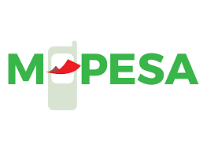

<!--   my-icons -->

    
    
    
    
    
       

<!--   my-header-img -->

# 💫 About Me:

<h4 align="justify"> I am a self-taught programmer driven by a relentless passion for computer science, with a strong focus on machine learning and AI. My insatiable curiosity fuels my pursuit of knowledge, constantly pushing the boundaries of what is possible. Dedicated to harnessing the power of technology, I am committed to creating innovative solutions and unlocking the transformative potential of intelligent systems.
   
   
   
   "Caddaalad iyo nabad waa kuwa sharafta leh." (Peace and tranquility are attributes of honor.)      🛣️I'm still on my roadmap to full-stack Dev         🔍Conducting my own research on AI and Computer Vision  💡 Open to collaborating on projects and innovative ideas.  💻 Currently working on Private projects   

    
    Collaborations and Business WhatsApp: +254 798 244 407

    
    Email: shermacksalat@gmail.com

# 💻 Techstack:
| Property                                        | Data                                                                                                                                                                                                                                                                                                                                                                                                                                                                                                                                                                                                                                                                                                                                                                                                                                                                                                                                                                                                                                                                                                                                                                                                                                                                                                                                                                                                                                                                                                                                                                                                                                                                                                                                                                                                            |
|-------------------------------------------------|-----------------------------------------------------------------------------------------------------------------------------------------------------------------------------------------------------------------------------------------------------------------------------------------------------------------------------------------------------------------------------------------------------------------------------------------------------------------------------------------------------------------------------------------------------------------------------------------------------------------------------------------------------------------------------------------------------------------------------------------------------------------------------------------------------------------------------------------------------------------------------------------------------------------------------------------------------------------------------------------------------------------------------------------------------------------------------------------------------------------------------------------------------------------------------------------------------------------------------------------------------------------------------------------------------------------------------------------------------------------------------------------------------------------------------------------------------------------------------------------------------------------------------------------------------------------------------------------------------------------------------------------------------------------------------------------------------------------------------------------------------------------------------------------------------------------|
| **Language / IDE**                              |                                                                                                                                                                                                                                                                                                                                                                                                                                                                                                                                                                                                                                                                                                                                                                                                                                                                                                                                                                                                                                                               |
| **Domain Knowledge**                            |                                                                                                                                                                                                                                                                                                                                                                                                                                                                                                                                                                                                                                                                                                                                                                                                                                                                                                                                                                                                                                                                                         |
| **CI / CD**                                     |                                                                                                                                                                                                                                                                                                                                                                                                                                                                                                                                                                                                                                                                                                                                                                                                                                                                                                                                                                                                                                                                                                                                                                                                                                                                                                                                                                                          |
| **Databases**                                   |                                                                                                                                                                                                                                                                                                                                                                                                                                                                                                                                                                                                                                                                                                                                                                                                                                                                                                |
| **OS**                                          |                                                                                                                                                                                                                                                                                                                                                                                                                                                                                                                                                                                                                                                                                                                                                                                                                                                                                                                                                                                                                                                                                                                                                                                                                                                                                                                                                       |
| **Tools & Platform**                            |                                                                                                                                                                                                                                                                                                                                                                                                                                                                                                                                                                                                                                                                                                                                                                                                                                                                                                                                                                                                                                                                                                                                                                                                                                                                                                                                                                                                                                                                                                                                          |
| **Machine Learning / Deep Learning frameworks** | ![Jupyter Notebook](http://img.shields.io/badge/-Jupyter%20Notebook-eee?style=flat-square&logo=data:image/png;base64,iVBORw0KGgoAAAANSUhEUgAAAA4AAAAQCAMAAAARSr4IAAACGVBMVEVhYmJdYWT/fBfzdyaqdlV2dnfcdC9udnz5dyKUaU3wdicCO2CzZzVdUkpOTk5MTk60ZzUAAP/XcC3fcivgciv/lArAajLqdSifYjrydyajnJjEjWifnp3FjGcAAACenp52dnd2dnd2dndhYmJhYmIxW3bzdybzdybzdybzdybzdyb/dxpydnl2dnd2dndhYmJgYmOda0r0dyXzdybzdybzdybudymQdmZldoJQYGmRaU7ydyfzdybzdybzdybzdybzdybzdybzdyb1dyX9dx/2dyXzdybzdybzdyb+eiPzdybzdybzdyb/ghz8eSQ3SFT/tABNTk5HTFBMTk5OTk5OTk5OTk5OTk5OTk5OTk5OTk5OTk5NTk5GTFBOTk5OTk5OTk5OTk5OTk5OTk5OTk5OTk5OTk5OTk5OTk5OTk5OTk5OTk5OTk5NTk5OTk5OTk5OTk5OTk5OTk5OTk5OTk5OTk5NTk5NTk5UUEx5WUMAOGRMTU9OTk5OTk5OTk5OTk5OTk5FTFAXQFvBajK8aTP2eCX0dyb0dyb0dybzdyb4eCXzdybzdybzdybzdybzdybzdybzdybzdybzdyb6dB3zdyXzdybzdybzdybzdybzdybzdybzdyaenp6cn6HKimD0dyXzdybzdybzdybzdybzdybzdyaenp6enp6dn6Dzdybzdyaenp6enp6enp6enp7zdyaenp7///9F1GYlAAAAsHRSTlMAAAAAAAAAAAAAAAAAAAAAAAAAAAAAAAAAAAAAAAAAADHCVho4Ax1RcnFOFz/ibFmwHXPc/thwKwkKJpfbqn1oaX+uighRdSIDAyV6TAQcAgIVHBMbKjIgEzBTHCsbLUBdQlhiTWBlR1xkaEVIR1tPbFEvF0pJNR9AFAQIMwgfKQUDBwgDBEsuMkcCLLSUKBsqT5iwNcX47N/g7cAxPmUqZq/OzaxiExPJYgQPCJjcP9lVnrgAAAClSURBVAjXVcyxSoIBAEXh+xkhEkFr6hD0AM5BkbQ3ODaEY4uDSENCS1BThI/h4v4TERG0NzZHvoAQ0SDV8FvkmS6cw5UgSTR5s83rlgUvWuA8l/Bs59eYbXhS28VdUt1H4dA9Eu1HexUdS3T/7Y81vXJ9rQicLcxoAK64hvd1fWwOeDgoy+JW3bCs56tOonnxd3ycGKt9nt7I91GShgn60yRJI/kBP8EfEEdOa6sAAAAASUVORK5CYII=&logoColor=F37626)    |                                                                                                                                                                              

<html>
<head>
    <title>Buy Me a Coffee</title>
    
</head>
<body>
    

        
        <h1>Buy Me a Coffee</h1>
        

            <label for="phone_number">Phone Number:</label>
            <input type="text" name="phone_number" id="phone_number" placeholder="Enter your phone number">
            <label for="amount">Amount:</label>
            <input type="number" name="amount" id="amount" placeholder="Enter the donation amount">
            <button type="submit">Buy Me a Coffee</button>
        

         
        
        
M-Pesa Phone Number:

        
XXXXXXX

    

</body>
</html>
                                                                                                                                                                                                                                                                                                                                                                                                                                                                                                                                                                                                                                                                                                                                                                                                                                                                                                                                                                                                                                                                                                                                                                                                                                                                                                                        
# 📊 GitHub Stats:
 
 

<!--   profile-green-animate -->

<!--   grid-snake -->

 
## 🏆 GitHub Trophies

## 🐦 Latest Tweet

---

<!-- Proudly created with GPRM ( https://gprm.itsvg.in ) -->
